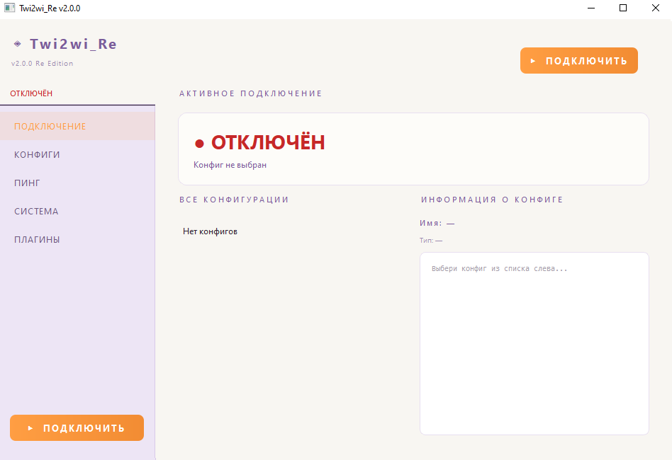

# Twi2wi_Re 🔐

> Lightweight Windows VPN client with AmneziaWG and sing-box support. Fast, simple, and efficient. Russian interface.

[](https://github.com/Atomicpickleofworld/Twi2wi_Re/releases)
[](LICENSE)
[](https://python.org)
[](https://www.riverbankcomputing.com/software/pyqt/)

<p align="center">
  
</p>

## 📋 About

**Twi2wi_Re** is a lightweight GUI client for managing VPN connections on Windows, designed with simplicity and performance in mind. It supports modern protocols: **AmneziaWG** (WireGuard fork with DPI resistance) and **sing-box**.


### ✨ Features

- 🇷🇺 Full Russian-language interface
- 🔐 Supported protocols:
  - AmneziaWG / WireGuard
  - sing-box (JSON configurations)
- ⚡ One-click connect/disconnect
- 📊 Real-time ping monitoring to selected hosts
- 🗂️ Convenient configuration management:
  - Import from file or clipboard
  - Parse links (`vless://`, `vmess://`, `trojan://`, `wg://`, etc.)
  - Edit, rename, delete profiles
  - Favorites for quick access
- 🧩 Plugin-ready architecture *(UI tab exists, functionality WIP)*
- 🪟 Wintun integration for stable Windows networking
- 🛡️ Requires administrator privileges for network interface management

> 💡 **Note about Plugins tab**: The Plugins section is currently visual-only. The interface is implemented, but backend functionality is under development. Future updates will enable custom plugin support.

## ⚠️ Important

- Requires administrator rights
- Do not spam the connect button (may cause instability)
- Antivirus software may flag VPN tools (false positive)

## 🛠️ Tech Stack

- Python (PyQt6)
- AmneziaWG
- sing-box 1.11.3
- Wintun


## 🚀 Quick Start

### System Requirements

- **OS**: Windows 10/11 (x64)
- **Python**: 3.10 or higher
- **Dependencies**: See `requirements.txt`

### Installation

1. **Clone the repository**:
   ```bash
   git clone https://github.com/Atomicpickleofworld/Twi2wi_Re.git
   cd Twi2wi_Re
   ```

2. **Create a virtual environment and install dependencies**:
   ```bash
   python -m venv venv
   venv\Scripts\activate
   pip install -r requirements.txt
   ```

3. **Run the application as Administrator**:
   ```bash
   python main.py
   ```
   > ⚠️ The application will show an error and exit if not run with administrator privileges.

### 📦 Building Executable (Optional)

To create a standalone `.exe`:
```bash
pip install pyinstaller
pyinstaller --onefile --windowed --icon=assets/icon.ico main.py
```

## 🗂️ Project Structure

```
Twi2wi_Re/
├── main.py                 # Entry point, QApplication init
├── README.md               # Documentation
├── LICENSE                 # MIT License
├── requirements.txt        # Python dependencies
│
├── core/                   # Business logic
│   ├── __init__.py
│   ├── vpn_worker.py       # Worker for sing-box process management
│   └── ping_worker.py      # Async ping monitoring
│
├── ui/                     # PyQt6 UI components
│   ├── __init__.py
│   ├── main_window.py      # Main VPNManager class
│   ├── styles.py           # CSS styling for interface
│   └── widgets/
│       └── config_card.py  # Configuration card widget
│
├── utils/                  # Helper modules
│   ├── __init__.py
│   ├── version.py          # App version management
│   ├── config.py           # Paths and settings
│   ├── helpers.py          # Utilities: detect_type, get_system_info
│   ├── url_parser.py       # Parse VPN links to sing-box JSON
│   └── plugin_manager.py   # Plugin system *(scaffolded, WIP)*
│
├── assets/                 # Resources: icons, images
│   └── logo.png
│
└── old-ver/                # Archive of previous versions
    └── 0.2.0/
```

## ⚙️ Configuration

Configurations are stored at:
```
%APPDATA%\Twi2wi_Re\configs\
├── configs.json    # List of all profiles
├── *.json          # sing-box configurations
└── *.conf          # AmneziaWG/WireGuard configurations
```

### Entry format in `configs.json`:
```json
{
  "name": "My VPN",
  "type": "singbox",
  "content": "{...sing-box config...}",
  "path": "C:\\Users\\...\\configs\\my_vpn.json",
  "favorite": false
}
```

## 🔌 Supported Import Schemes

The application can parse links for the following protocols:
- `vless://`, `vmess://`, `trojan://`, `ss://`, `hysteria://`, `tuic://`
- `wg://`, `amnezia://` (WireGuard/AmneziaWG)

Simply paste a link into the import field — the config will be automatically converted to sing-box format.

## 📌 Roadmap

- [ ] English interface
- [ ] Config marketplace
- [ ] Built-in config editor
- [ ] Auto-connect on startup
- [ ] Private servers support
- [ ] Plugins backend implementation 🔌

## 🔢 Version Numbering

Twi2wi_Re uses a clear `X.Y.Z` versioning scheme to indicate the scope of each release:

| Position | Name | Description |
|----------|------|-------------|
| `X` | **Global Patch** | Major updates: core architecture changes, breaking updates, engine upgrades (e.g., new sing-box major version) |
| `Y` | **Average Patch** | Feature releases: new UI elements, protocol support, settings, or significant functionality improvements |
| `Z` | **Micro-Patch** | Bug fixes, performance optimizations, stability tweaks, and minor security patches |

**Examples:**
- `0.2.0` → Test release
- `1.3.0` → A global patch with significant changes
- `1.4.1` → Feature update (current release)

### 🔤 Letter Suffixes (Reserved)
While not currently in use, the following suffixes may be appended to version strings for pre-releases or emergency builds:

| Suffix | Meaning | When to use |
|--------|---------|-------------|
| `-a` / `alpha` | Early test build | Internal/experimental, may contain unfinished features or instability |
| `-b` / `beta` | Public test build | Feature-complete, released for community feedback before stable tag |
| `-rc` | Release Candidate | Final validation phase; expected to become the next stable `X.Y.Z` |
| `-hf` / `hotfix` | Emergency patch | Bypasses normal `Z` increment for critical crash/security fixes |

> 💡 **Note:** Suffixes are only used for pre-release or emergency builds. All stable public releases strictly follow the `X.Y.Z` format.


## 💬 Disclaimer

This project is for educational and personal use only.  
Use responsibly and in compliance with your local laws.

## ⭐ Support

If you like this project — give it a star ⭐  
Future versions may include private server support and config distribution features.

## 🤝 Contributing

1. Fork the repository
2. Create a feature branch (`git checkout -b feature/amazing-feature`)
3. Commit your changes (`git commit -m 'Add amazing feature'`)
4. Push to the branch (`git push origin feature/amazing-feature`)
5. Open a Pull Request

## 📄 License

Distributed under the **MIT License**. See [LICENSE](LICENSE) for more information.

## 👤 Author

**Atomicpickleofworld**  
[GitHub Profile](https://github.com/Atomicpickleofworld)

## 🙏 Acknowledgements

- [AmneziaVPN](https://amnezia.org/) — for AmneziaWG protocol
- [sing-box](https://sing-box.sagernet.org/) — for the universal proxy core
- [Wintun](https://www.wintun.net/) — for Windows TUN driver
- PyQt6 community — for the excellent UI framework

---

> ⚠️ **Warning**: Use this application only for lawful purposes and in accordance with the legislation of your country. The author is not responsible for any misuse of this software.
```

---
