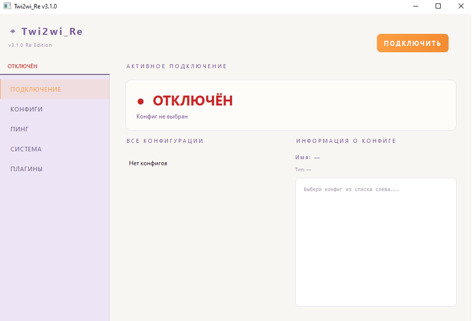
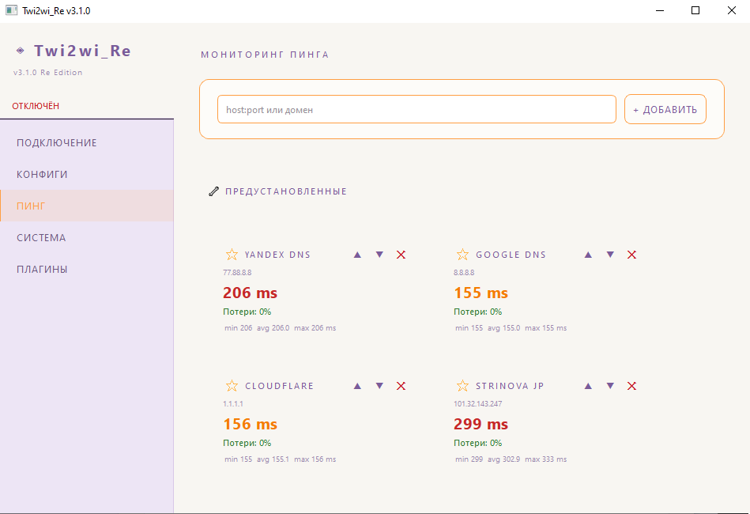
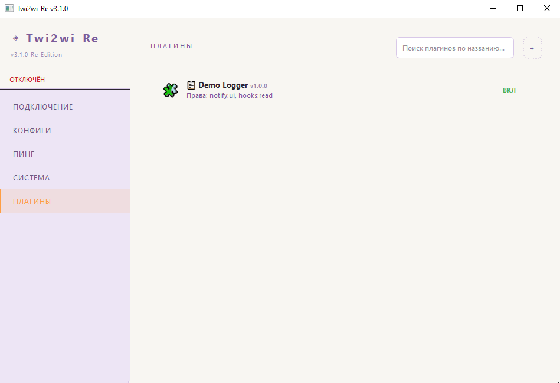
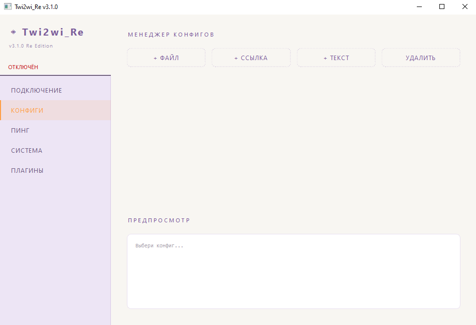
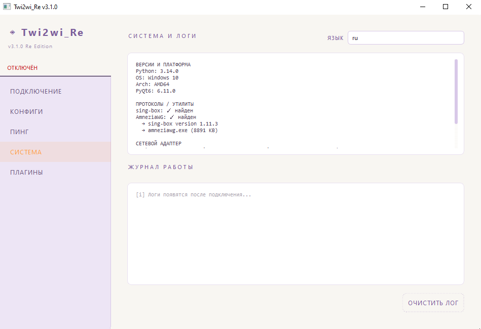

# Twi2wi_Re
 

> Lightweight Windows VPN client with AmneziaWG and sing-box support.
> Modular, secure, and beautiful. Now with plugin sandbox, ping monitor, and adaptive UI.

<p align="center">
  

---

## 🚀 v3.1.0 — Major Update

This release represents a **complete architectural rewrite** from monolithic to modular, with significant new features and security hardening.

### ✨ What's New

| Feature | Description |
|---------|-------------|
| 🧩 **Plugin System** | Fully working sandbox — plugins run in isolated subprocesses with `plugin.json` manifest, permission system, and integrity checks. |
| 📊 **Ping Monitor 2.0** | Parallel ICMP ping with min/avg/max stats. Favorites, custom sorting (▲/▼), per-card delete. Adaptive FlowLayout — cards fill the row and wrap on resize. |
| 🛡️ **Secure URL Parser** | Validates all input, limits payload size, sanitizes filenames. Destroys path-traversal and zip-slip vectors. |
| 🌐 **Multi-language** | 4 languages: Russian, German, "L33T H4X0R", Old Slavonic. Auto-detection + live switching. |
| 🎨 **Refined UI** | Adaptive cards. Color-coded ping/loss. Plugin status indicator. Rounded borders everywhere. |
| 🏗️ **Modular Architecture** | `ConnectController`, `ConfigsController`, `PingController`, `PluginsController` — each page owns its logic. `VPNManager` is a clean bridge. |

### 🔐 Security Improvements

- All URL/user input sanitized and validated
- Path traversal blocked at parser level
- Plugin sandbox: blocked modules (`os`, `subprocess`, `socket`, etc.), filesystem jail, integrity verification
- Configs validated before save (JSON structure, ports, hosts)
- No `eval()`, no `exec()`, no shell injection

---

## 📸 Screenshots

<details>
<summary>🔌 Connect Page</summary>

</details>

<details>
<summary>📊 Ping Monitor (NEW)</summary>

</details>

<details>
<summary>🧩 Plugins (NEW)</summary>

</details>

<details>
<summary>📁 Config Manager</summary>

</details>

<details>
<summary>⚙️ System & Logs</summary>

</details>

---

## ⚙️ Tech Stack

- **Python 3.10+** + **PyQt6**
- **sing-box 1.11.3** — universal proxy core
- **AmneziaWG** — WireGuard fork with DPI resistance
- **Wintun** — Windows TUN driver

## 🔌 Supported Protocols

`vless://` · `vmess://` · `trojan://` · `ss://` · `hysteria2://` · `tuic://` · `socks5://` · raw WireGuard/AmneziaWG config

---

## 📦 Quick Start

### Requirements
- Windows 10/11 x64
- Python 3.10+
- Administrator privileges

### Run
```bash
git clone https://github.com/Atomicpickleofworld/Twi2wi_Re.git
cd Twi2wi_Re
pip install -r requirements.txt
python main.py
```

### Build EXE
```bash
pyinstaller --onefile --windowed --icon=assets/icon.ico main.py
```

---

## 🗂️ Project Structure (v3.1.0)

```
Twi2wi_Re/
├── main.py                    # Entry point
├── core/                      # Business logic
│   ├── vpn_worker.py          # sing-box + AmneziaWG process manager
│   ├── ping_worker.py         # Parallel ICMP ping with stats
│   └── validator.py           # Input validation & sanitization
├── ui/                        # PyQt6 interface
│   ├── main_window.py         # VPNManager bridge
│   ├── styles.py              # QSS theme
│   ├── widgets.py             # ConfigCard widget
│   └── pages/
│       ├── connect_page.py    # ConnectController
│       ├── configs_page.py    # ConfigsController
│       ├── ping_page.py       # PingController + FlowLayout
│       ├── sys_page.py        # System info & logs
│       └── plugins_page.py    # PluginsController
├── security/                  # Plugin sandbox system
│   ├── sandbox.py             # SandboxManager + zip installer
│   ├── plugin_runner.py       # Subprocess entry point
│   └── permissions.py         # Manifest validation & whitelist
├── utils/                     # Utilities
│   ├── config.py              # Paths & settings
│   ├── helpers.py             # detect_type, system_info
│   ├── i18n.py                # Multi-language system
│   ├── url_parser.py          # Secure proxy URL parser (8 protocols)
│   └── version.py             # Version management
├── locales/                   # Translations
│   ├── ru.json                # Russian
│   ├── secret_de.json         # German (angst mode)
│   ├── secret_l33t.json       # L33T H4X0R
│   └── secret_ru.json         # Old Slavonic
├── plugins/                   # Plugin directory
│   └── demo_logger/           # Example plugin
├── assets/                    # Screenshots & icons
└── old-ver/                   # Archived versions
    └── 0.2.0/                 # v0.2.0 — the very first build
```

---

## 🔬 Evolution: v0.2.0 → v3.1.0

| Component | v0.2.0 | v3.1.0 |
|-----------|--------|--------|
| Architecture | Monolith (~750 lines) | Controllers + sandbox |
| Ping | TCP connect | Parallel ICMP + stats + favorites |
| Plugins | None | Full sandbox system |
| Security | None | Input validation, path jail, blocked modules |
| Languages | Russian only | 4 languages, live switching |
| UI | Fixed strings | `tr()` everywhere, adaptive layout |

> 📜 See `old-ver/0.2.0/` for the original single-file prototype. Written in half a day. The spirit remains — the architecture evolved.

---

## 📌 Roadmap

- [x] Plugin sandbox system
- [x] Advanced ping monitor
- [x] Multi-language support
- [x] Input security hardening
- [ ] English interface (full)
- [ ] Dark theme
- [ ] Config marketplace
- [ ] Auto-connect on startup
- [ ] Built-in traceroute diagnostics

---

## ⚠️ Disclaimer

This project is for educational and personal use. Use responsibly and in compliance with your local laws.

## 📄 License

MIT License. See `LICENSE` for details.

## 👤 Author

**Atomicpickleofworld** · [GitHub Profile](https://github.com/Atomicpickleofworld)
